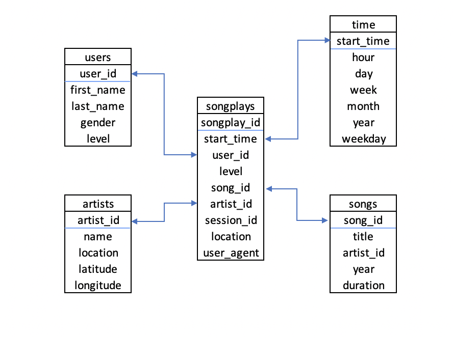

## Project 4: Data Lake

#### Introduction
A music streaming startup, Sparkify, has grown their user base and song database even more and want to move their data warehouse to a data lake. Their data resides in S3, in a directory of JSON logs on user activity on the app, as well as a directory with JSON metadata on the songs in their app.

#### Project Description
This project is to build an ETL pipeline that extracts their data from S3, processes them using Spark, and loads the data back into S3 as a set of dimensional tables. This will allow their analytics team to continue finding insights in what songs their users are listening to.

#### File Description
```etl.py``` reads data from S3, processes that data using Spark, and writes them back to S3 <br>
```dl.cfg``` contains AWS credentials

#### Database Schema
Fact table: songplays <br>
Dimensions tables: songs, artists, users, and start_time
* Fields with underline are primary keys.


#### How to Run
* Open the terminal
* Enter `` python etl.py`` to execute the ETL process
